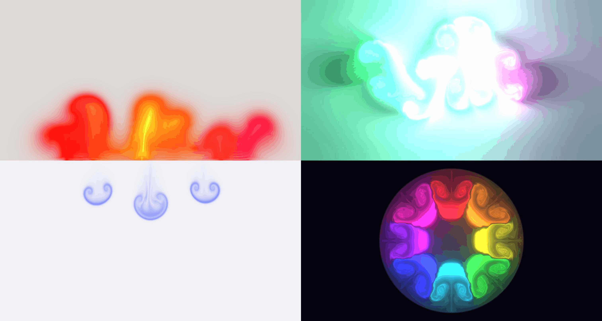

[](https://github.com/tommyyzhao/svelte-fluid/actions/workflows/ci.yml)
[](https://www.npmjs.com/package/svelte-fluid)
[](LICENSE)

# svelte-fluid

WebGL fluid simulation as a Svelte 5 component library.

<p align="center">
  
</p>

<p align="center">
  <strong><a href="https://tommyyzhao.github.io/svelte-fluid/">Live demo</a></strong>
</p>

### Why this library?

Other WebGL fluid packages are vanilla JS wrappers around the same upstream
simulation. svelte-fluid is purpose-built for Svelte 5:

- **True component API** — `<Fluid />` with 40+ typed props, live reactive updates, and full cleanup on unmount
- **Multiple independent instances** per page — no shared GL state
- **Deterministic seeding** — same `seed` reproduces the same splat pattern across resizes
- **8 presets** — drop-in `<LavaLamp />`, `<Aurora />`, `<CircularFluid />`, etc.
- **4 container shapes** — circle, frame, roundedRect, annulus via SDF masking
- **Lazy loading + auto-pause** — defer engine creation until viewport entry
- **Imperative API** — `splat()` and `randomSplats()` via `bind:this`

## Install

```sh
npm install svelte-fluid
# or
pnpm add svelte-fluid
# or
bun add svelte-fluid
```

> Requires Svelte ≥ 5.

## Quick start

```svelte
<script lang="ts">
  import { Fluid } from 'svelte-fluid';
</script>

<div style="width:100%; height:100vh">
  <Fluid />
</div>
```

That's the entire setup. The canvas fills its parent and tracks parent
size via `ResizeObserver`.

### Fixed dimensions

```svelte
<Fluid width={400} height={300} />
```

### Custom physics

```svelte
<Fluid
  curl={20}
  splatRadius={0.5}
  bloom={false}
  shading
  densityDissipation={0.4}
  initialSplatCount={12}
  seed={42}
/>
```

### Imperative API via `bind:this`

```svelte
<script lang="ts">
  import { Fluid, type FluidHandle } from 'svelte-fluid';

  let ref = $state<{ handle: FluidHandle } | undefined>();
</script>

<button onclick={() => ref?.handle.randomSplats(10)}>Splat!</button>
<Fluid bind:this={ref} />
```

## Browser compatibility

- **WebGL 1** (with linear filtering) and **WebGL 2** both work
- Tested on Chrome 120+, Firefox 121+, Safari 17+
- **Mobile:** works on iOS Safari 16+ and Chrome Android, with `lazy={true}`
  strongly recommended on dense pages
- **Linear filtering fallback:** when `OES_texture_float_linear` is unavailable,
  the engine drops shading, bloom, sunrays and clamps `dyeResolution` ≤ 512 —
  see `FluidEngine.initContext()`

## Props

All props are optional. CamelCase wraps the original SCREAMING_CASE
config from the upstream project.

| Prop | Type | Default | Notes |
| --- | --- | --- | --- |
| `width` | `number` | — | CSS px. Omit to fill parent. |
| `height` | `number` | — | CSS px. Omit to fill parent. |
| `seed` | `number` | random | 32-bit uint; deterministic initial splats |
| `simResolution` | `number` | `128` | velocity grid; **rebuilds FBOs** |
| `dyeResolution` | `number` | `1024` | dye grid; **rebuilds FBOs** |
| `densityDissipation` | `number` | `1` | hot; **steady-state** value |
| `initialDensityDissipation` | `number` | (= `densityDissipation`) | hot; ramp start (see [burn-in pattern](#burn-in-density-dissipation)) |
| `initialDensityDissipationDuration` | `number` | `0` | seconds; duration of the linear ramp |
| `velocityDissipation` | `number` | `0.2` | hot |
| `pressure` | `number` | `0.8` | hot |
| `pressureIterations` | `number` | `20` | hot |
| `curl` | `number` | `30` | vorticity confinement; hot |
| `splatRadius` | `number` | `0.25` | hot |
| `splatForce` | `number` | `6000` | hot |
| `shading` | `boolean` | `true` | **shader recompile** |
| `colorful` | `boolean` | `true` | hot |
| `colorUpdateSpeed` | `number` | `10` | hot |
| `paused` | `boolean` | `false` | hot |
| `backColor` | `{r,g,b}` | `{0,0,0}` | 0–255 RGB; hot |
| `transparent` | `boolean` | `false` | hot |
| `bloom` | `boolean` | `true` | **shader recompile** |
| `bloomIterations` | `number` | `8` | **rebuilds FBOs** |
| `bloomResolution` | `number` | `256` | **rebuilds FBOs** |
| `bloomIntensity` | `number` | `0.8` | hot |
| `bloomThreshold` | `number` | `0.6` | hot |
| `bloomSoftKnee` | `number` | `0.7` | hot |
| `sunrays` | `boolean` | `true` | **shader recompile** |
| `sunraysResolution` | `number` | `196` | **rebuilds FBOs** |
| `sunraysWeight` | `number` | `1` | hot |
| `initialSplatCount` | `number` | — | exact count for the first frame |
| `initialSplatCountMin` | `number` | `5` | min of random range |
| `initialSplatCountMax` | `number` | `25` | max of random range |
| `randomSplatRate` | `number` | `0` | continuous splats/sec; 0 = disabled (Bucket A) |
| `randomSplatCount` | `number` | `1` | splats per continuous burst (Bucket A) |
| `randomSplatColor` | `{r,g,b}` | `null` | fixed color for continuous splats; null = random (Bucket A) |
| `randomSplatDx` | `number` | `0` | x velocity for continuous splats (Bucket A) |
| `randomSplatDy` | `number` | `0` | y velocity for continuous splats (Bucket A) |
| `randomSplatSpawnY` | `number` | `0.5` | normalized y position for continuous splats (0–1, clamped) (Bucket A) |
| `pointerInput` | `boolean` | `true` | hot; toggles canvas + window listeners |
| `splatOnHover` | `boolean` | `false` | hot; splat on mousemove without click |
| `presetSplats` | `PresetSplat[]` | — | construct-only; declarative initial scene (see [Presets](#presets)) |
| `lazy` | `boolean` | `false` | construct-only; defer engine creation until container enters viewport |

The component also forwards any standard `<canvas>` attributes
(`class`, `style`, `aria-label`, …) onto the underlying canvas via
`...rest`.

## Presets

Eight opinionated wrapper components ship alongside `<Fluid />`. Each one
hard-codes a physics + visual configuration and (for most of them) a
hand-crafted set of opening splats so you can drop them in without any
tuning:

| Component | Look |
| --- | --- |
| `<LavaLamp />` | Slow warm blobs rising in a dim purple ambience |
| `<Plasma />` | Persistent full-spectrum energy field |
| `<InkInWater />` | Dark blue dye blooming on a pale background |
| `<FrozenSwirl />` | A single icy whirlpool that spins itself out |
| `<Aurora />` | Green, magenta, and pale-blue ribbons drifting like northern lights |
| `<CircularFluid />` | Vivid plasma ball physically confined inside a circle |
| `<FrameFluid />` | Colorful fluid swirling around a rectangular inner cutout |
| `<AnnularFluid />` | Ring-vortex fluid confined between two concentric circles |

```svelte
<script lang="ts">
  import { LavaLamp, Plasma } from 'svelte-fluid';
</script>

<div style="height: 100vh">
  <LavaLamp />
</div>

<div style="display:grid; grid-template-columns:repeat(2, 1fr); gap:16px">
  <Plasma />
</div>
```

Each preset accepts only `width`, `height`, `class`, `style`, `seed`,
`lazy`, and `aria-label` — the rest of the configuration is intentionally fixed. They all
re-expose the imperative `handle` so you can still call `splat()` /
`randomSplats()` from outside via `bind:this`.

### Building your own preset

A preset is a tiny wrapper around `<Fluid />` that pins config and
optionally passes a `presetSplats` array. The engine consumes
`presetSplats` once at construction (right after the random initial
splats), so the opening scene is fully deterministic and reproducible
across resizes.

```svelte
<script lang="ts">
  import { Fluid, type PresetSplat, type FluidHandle } from 'svelte-fluid';

  const SPLATS: PresetSplat[] = [
    { x: 0.5, y: 0.1, dx: 0, dy: 800, color: { r: 1.6, g: 0.4, b: 0.1 } }
  ];

  let inner = $state<{ handle: FluidHandle } | undefined>();
  export const handle: FluidHandle = {
    splat: (x, y, dx, dy, c) => inner?.handle.splat(x, y, dx, dy, c),
    randomSplats: (n) => inner?.handle.randomSplats(n)
  };
</script>

<Fluid
  bind:this={inner}
  curl={50}
  densityDissipation={0}
  initialSplatCount={0}
  presetSplats={SPLATS}
/>
```

Note: `presetSplats` is **construct-only** — like `seed`, changes after
mount are ignored. To paint a new scene, change the `seed` (which forces
a teardown/rebuild) or call `handle.splat()` imperatively.

Splat coordinates are normalized: `x ∈ [0,1]` left-to-right and
`y ∈ [0,1]` **bottom-to-top**. Color components are in 0–1 range; values
above 1 are valid and read as HDR highlights through the bloom pass.

## Burn-in density dissipation

If you want a `densityDissipation: 0` "vivid persistent" look but the
opening splats are bright enough to overwhelm the canvas, use a
temporary high dissipation that decays to zero:

```svelte
<Fluid
  densityDissipation={0}
  initialDensityDissipation={1.5}
  initialDensityDissipationDuration={2}
  presetSplats={SPLATS}
/>
```

The engine linearly interpolates from `initialDensityDissipation` →
`densityDissipation` over `initialDensityDissipationDuration` seconds,
then holds at the steady-state value forever. This lets the overlapping
additive splats "burn in" — overbright pixels fade for the first couple
of seconds — before dissipation locks at zero so the remaining dye
persists indefinitely. The `LavaLamp` and `Plasma` presets
use this pattern.

The clock starts when the engine begins ticking (post-mount, post
first ResizeObserver fire), so the burn-in survives `setConfig`
updates and matches the user's perception of "since the canvas
appeared".

## Resize behavior

A `ResizeObserver` watches the wrapper container. Whenever the CSS
dimensions change, the engine is fully torn down and reinstantiated with
the same `seed`, so the initial splat pattern is identical. If you don't
provide a `seed`, the component generates one once at mount and reuses
it across resizes.

## Multiple instances

Each `<Fluid />` owns its own WebGL context, framebuffers, RAF loop,
listeners, and pointer state. Browsers cap simultaneous WebGL contexts
at 8–16 per tab, so plan accordingly for very dense layouts.

For pages with more than ~6 simultaneous instances, pass `lazy={true}`
on each one. The component will then defer engine creation until the
container enters the viewport (with a 200px lookahead) and tear it
down when it leaves, keeping the live context count bounded:

```svelte
<LavaLamp lazy />
<Plasma lazy />
```

The cost is a one-time shader-recompile pause (~100–500ms) when an
instance scrolls back into view. For demo / showcase pages this is
hidden behind the user's scroll momentum and rarely noticed.

## Programmatic engine

If you need raw control without the Svelte component:

```ts
import { FluidEngine } from 'svelte-fluid';

const canvas = document.querySelector('canvas')!;
canvas.width = canvas.clientWidth * devicePixelRatio;
canvas.height = canvas.clientHeight * devicePixelRatio;

const engine = new FluidEngine({
  canvas,
  config: { curl: 20, bloom: false, seed: 42 }
});

// later…
engine.splat(0.5, 0.5, 100, 0, { r: 1, g: 0.5, b: 0 });
engine.randomSplats(8);
engine.setConfig({ curl: 5 });
engine.dispose();
```

## Development

This project uses **bun**.

```sh
bun install
bun run dev      # demo playground at http://localhost:5173
bun run check    # svelte-check
bun run package  # produces dist/ with svelte-package
bun run build    # builds the SvelteKit demo site
```

## Acknowledgments

This library is a derivative work of
[PavelDoGreat/WebGL-Fluid-Simulation](https://github.com/PavelDoGreat/WebGL-Fluid-Simulation),
the original 2017 WebGL implementation by Pavel Dobryakov. The shader
sources are reused unchanged. Both the upstream project and this port
are MIT-licensed; see `LICENSE` for the full notices.
