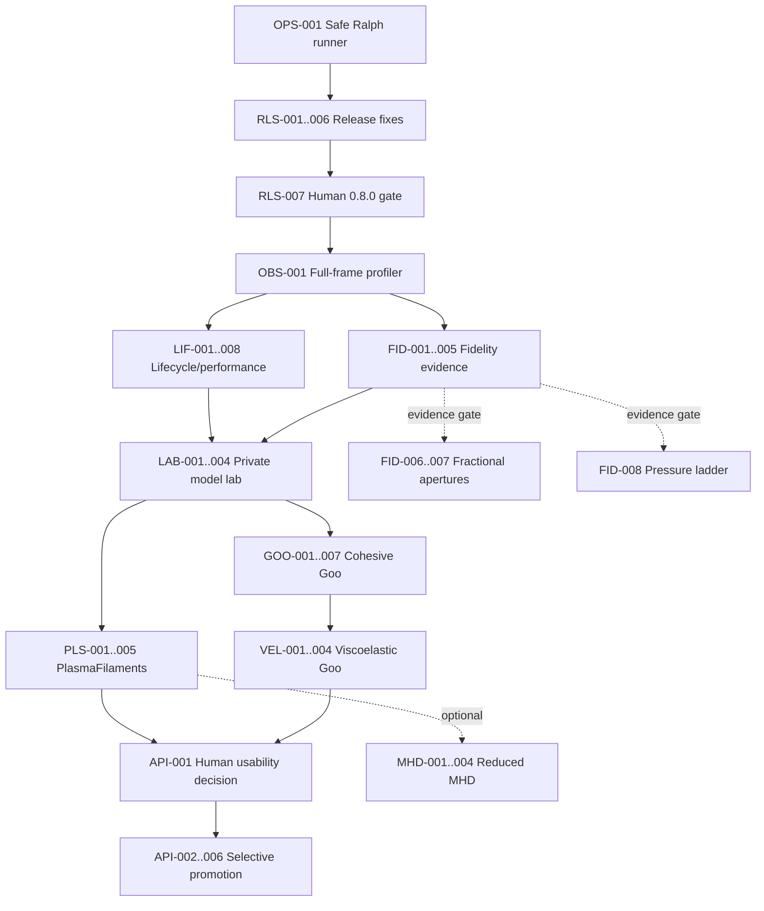

# Epic 0002 — Performance, Fidelity, and Material Modes

**Status:** Planned; no implementation started  
**Branch:** `codex/engine-roadmap-plan`  
**Owner:** engine/product  
**Scope:** release stabilization, engine lifecycle/performance, measured fidelity
experiments, and private-lab validation of plasma-inspired and viscoelastic material
models before any permanent public API or main-demo commitment.

## 1. Product contract and locked decisions

- The product remains a decorative, client-only Svelte 5 WebGL library. No backend,
  telemetry, accounts, persistent data, or network service is added.
- Existing APIs and presets remain compatible. New solver/model behavior is disabled
  by default until explicitly promoted.
- Existing components retain WebGL1 and WebGL2 support and degrade rather than throw or
  render blank.
- No runtime dependencies. Engine/Svelte/GL module boundaries and explicit resource
  ownership remain unchanged.
- MacCormack remains opt-in and no built-in preset adopts it without new evidence and
  human visual approval.
- CI golden images remain cut by ADR-0050. Deterministic field metrics gate physics;
  real-browser human QA gates composited appearance.
- Timing results are recorded with renderer, browser, DPR, canvas size, grid size, and
  scene. Absolute GPU timings do not become cross-machine CI assertions.
- New plasma/goo controls live only on an unlisted lab route during validation. They do
  not enter `FluidConfig`, package exports, generated agent docs, canonical public docs,
  the main demo, navigation, or sitemap until the explicit promotion wave.
- Existing `Plasma` remains exported. Its copy must describe it as a visual preset, not
  magnetic or discharge physics.
- `PlasmaFilaments` is an advected reaction-diffusion/emission model. Goo is a bounded
  phase/material field with shear-dependent viscosity, cohesion, and bounded FENE-P
  elasticity. Reduced MHD is an optional WebGL2-only experiment. Full MHD, streamer
  discharge, and WebGPU MPM are research-only.
- Releases continue through Changesets; no manual npm publish.

## 2. New invariants

1. **Requested versus resolved model is observable.** An unsupported experimental model
   resolves to an explicit fallback and never fails silently.
2. **Experimental model state does not leak into the package surface.** Until promotion,
   public `.d.ts`, `dist`, docs, agent docs, navigation, and sitemap contain no model
   controls or experimental components.
3. **Optional features own their resources.** Each optional model/post-process group has
   explicit create/resize/dispose behavior; no module-level GL state and no generic pass
   graph.
4. **Every allocation has a lifecycle test.** Create/resize/context-restore/dispose paths
   must balance GL allocations and deletions.
5. **No performance win may be a liveness loss.** Timing comparisons require field
   liveness and non-finite guards.
6. **Existing-preset performance budget.** On the pinned reference environment, median
   GPU frame time for the existing representative suite may not regress by more than 5%
   without an explicit accepted ADR.
7. **High-DPR policy.** CSS pixels drive presentation-quality thresholds; physical
   pixels drive allocation caps. `maxPixelRatio` defaults to 2 after its documented minor
   release and offers an opt-out.
8. **Private-lab controls are disposable.** Their naming and shape are not semver surface;
   only approved high-level controls may later be promoted.
9. **One green story per Ralph iteration.** Every automated story leaves `bun run test`,
   `bun run check`, and `bun run prepack` green. Applicable browser stories also run
   `bun run test:browser` before completion.
10. **Human gates cannot be automated.** Ralph stops at visual/product/release gates and
    records evidence for a person; it never selects values or signs off appearance.

## 3. Operational prerequisites

- Execute Ralph only in a clean, disposable Git worktree on a dedicated non-main branch.
- `OPS-001` hardens the runner before any runtime story. Until it is complete, a human
  must create and verify the disposable worktree.
- Record a pinned Chromium version and `WEBGL_debug_renderer_info` result. If no physical
  mobile reference device is available, mobile timing is a recorded manual qualification,
  not a claim inferred from SwiftShader.
- GitHub Actions must be allowed to install Playwright Chromium for the browser-test job;
  no secrets are required.
- Wave 0 release fixes land and the `0.8.0` Version Packages flow is approved before the
  post-release roadmap branch is rebased onto published main.

## 4. Wave outcomes and gates

### Wave 0 — Stabilize and qualify the current `0.8.0` candidate

**Entry:** current local `main` at `aa60fab`; clean tree; existing local gates green.  
**Exit:** governor semantics match its ADR, public MacCormack is safe near solids,
context restore reproduces configured opening state, browser tests run in CI, Ralph can
operate without risking the primary worktree, Plasma copy is honest, and a human approves
the release candidate.  
**Rollback:** revert individual fixes; all are isolated and additive. Do not push if any
gate is red.

### Wave 1 — Measure and remove lifecycle/render overhead

**Entry:** Wave 0 released or explicitly approved; profiler baseline captured.  
**Exit:** resize preserves engine/context/state, quality thresholds use CSS pixels, DPR is
capped, framebuffer/program ownership is lazy and explicit, paused/empty scenes avoid
unnecessary work, and existing presets remain within the 5% regression budget.  
**Rollback:** in-place resize falls back to rebuild on failure; internal eager-allocation
and eager-compile switches remain available for one validation cycle.

### Wave 2 — Fidelity experiments with evidence gates

**Entry:** complete profiler and deterministic resolution/boundary sweeps.  
**Exit:** adaptive vorticity is resolution-stable; RK2 has a recorded accept/reject
decision; curved-boundary and pressure evidence either fires or closes their existing
gates. Default visuals change only after automated and human approval.  
**Rollback:** all experimental solver variants remain construct-only and default-off
until accepted.

### Wave 3 — Private material-model lab foundation

**Entry:** optional-resource lifecycle is complete.  
**Exit:** an unlisted route can select internal models, edit parameters, compare against a
Newtonian baseline, export/import settings, and show requested/resolved model, renderer,
draw counts, and timing. Nothing leaks into the package surface or main demo.  
**Rollback:** remove the route and internal model selector without affecting public API.

### Wave 4 — PlasmaFilaments private prototype

**Entry:** lab and internal resource contract complete.  
**Exit:** an advected reaction-diffusion field produces bounded, finite filamentary
emission on WebGL1/2, has a documented reduced-quality fallback, fits its performance
budget, and is available only in the lab for human testing.  
**Rollback:** internal model flag remains off; delete its feature resource group.

### Wave 5 — Cohesive Goo private prototype

**Entry:** lab and model lifecycle complete; phase-field readback metrics exist.  
**Exit:** a bounded material phase, shear-dependent variable viscosity, cohesion/surface
tension, thickness rendering, and a reported syrup fallback produce a stable cohesive
material in the lab.  
**Rollback:** resolve Goo to the syrup fallback; no public contract changes.

### Wave 6 — Viscoelastic Goo

**Entry:** Wave 5 stable and within budget.  
**Exit:** bounded FENE-P conformation transport and elastic stress create recoverable
stretch without non-finite values, negative conformation eigenvalues, or unacceptable
grid artifacts. Human testing determines whether it belongs in the Goo candidate.  
**Rollback:** elasticity strength zero is byte-equivalent to Wave 5 Goo; disable the
conformation resource group.

### Wave 7 — Optional reduced-MHD experiment

**Entry:** explicitly activated after PlasmaFilaments/Goo lab feedback; WebGL2 available.  
**Exit:** divergence-free magnetic field derived from scalar potential, bounded current
and Lorentz force, resistive diffusion, and emission are stable and measured in the lab.
It remains experimental unless separately promoted.  
**Rollback:** remove internal model and resources; PlasmaFilaments remains the fallback.

### Wave 8 — Human-controlled API promotion

**Entry:** user has tested private controls and approved named modes and a minimal control
set.  
**Exit:** only approved high-level wrappers and controls enter package exports, canonical
docs, generated agent docs, and the main demo with changesets and release qualification.
Unapproved models remain private or are deleted.  
**Rollback:** before publish, remove exports/docs; after publish, disable via resolved
fallback and issue a patch rather than silently changing semantics.

## 5. Dependency DAG

**Critical path:** `OPS-001 → RLS-001..007 → OBS-001 → LIF-001/002 → LAB-001/002 →
GOO-001..007 → VEL-001..004 → API-001..006`. Plasma joins the promotion gate but does
not block Goo implementation.  
**Parallelizable after Wave 0:** profiler-independent lifecycle refactoring can proceed
beside fidelity metric authoring; after the lab contract, Plasma math/tests and Goo
math/tests are logically parallel, although edits to `FluidEngine.ts`/`shaders.ts` should
be serialized or isolated to feature modules to avoid merge risk.

## 6. Ordered story catalog

Priorities: P0 release/operational blocker; P1 required foundation or committed mode;
P2 required qualification; P3 optional/gated fast-follow.

### Wave 0 stories

#### OPS-001 — Harden Ralph execution isolation (P0, manual-first)

**Depends:** none.  
**Description:** require a disposable worktree marker, reject the primary worktree, stop
with distinct `HUMAN_GATE_REACHED`/`BLOCKED` outcomes, and replace unconditional
`reset --hard`/`clean -fd` recovery with restoration limited to loop-owned changes.  
**Acceptance:** runner refuses main and an unmarked worktree; a synthetic failed task does
not delete a pre-existing untracked sentinel; gated/human work stops cleanly without four
false failure iterations; shell syntax check passes.  
**Likely files:** `.ralph/ralph-codex.sh`, `.ralph/PROMPT.md`, `.ralph/README.md` or
equivalent tests.  
**Notes:** establish the disposable worktree manually before asking the current runner to
implement this first story.

#### RLS-001 — Make overload duration genuinely sustained (P0)

**Depends:** OPS-001.  
**Description:** reset or decay overload duration when EMA returns below budget; separate
time-since-action from continuous-overload duration; make `lastAction` semantics stable
enough to inspect.  
**Acceptance:** intermittent spikes never shed; continuous overload sheds only after the
full configured interval; recovery breaks the interval; deterministic mode remains
byte-identical; node and synthetic browser tests pass.  
**Likely files:** `performance-governor.ts`, `FluidEngine.ts`, governor tests, ADR-0047
amendment or superseding ADR.

#### RLS-002 — Decouple target frame budget from simulation time (P0)

**Depends:** RLS-001.  
**Description:** introduce a refresh-aware or explicit target frame budget and separate
wall-clock catch-up clamping from quality `substeps`, preventing governor shedding from
slowing simulation time.  
**Acceptance:** 30/60/120 Hz synthetic sequences classify against the selected budget;
shedding substeps does not change accepted wall-clock delta for the same frame sequence;
existing default with `autoPerformance=false` is unchanged; public additions are fully
forwarded/documented and changesetted.  
**Likely files:** governor/types/engine/component, docs configuration/API/components,
agent docs, tests, ADR.

#### RLS-003 — Guard MacCormack departure paths near solids (P0)

**Depends:** OPS-001.  
**Description:** fall back to semi-Lagrangian advection when the departure segment or
limiter stencil crosses a blocked face, not merely when the destination cell is solid.  
**Acceptance:** analytical mask tests cover trace and stencil crossings; thin-wall browser
scene has no cross-wall velocity increase versus SL; dipole retention and NaN soak remain
green; default SL shader path remains byte-stable.  
**Likely files:** `shaders.ts`, `FluidEngine.ts`, MacCormack node/browser tests, ADR.

#### RLS-004 — Correct context restore and duplicate glass allocation (P0)

**Depends:** OPS-001.  
**Description:** retain construct-only preset splats or an explicit reseed policy through
context restore and eliminate duplicate glass framebuffer initialization on construction
and restore.  
**Acceptance:** deterministic preset restores to the documented opening policy; random
and configured splats are neither omitted nor doubled; glass allocates once per required
lifecycle transition; allocation/delete spies balance after restore/dispose.  
**Likely files:** `FluidEngine.ts`, lifecycle/context tests, ADR if restore semantics change.

#### RLS-005 — Run real browser tests in CI (P0)

**Depends:** OPS-001.  
**Description:** add an isolated browser job with pinned Bun/Playwright Chromium, explicit
browser install, caching, timeout, and artifact/log upload on failure.  
**Acceptance:** all 19 current browser tests run on pull requests and main; the job fails
on a deliberately failing test in branch validation; node/package job remains independent;
runtime stays under the workflow timeout.  
**Likely files:** `.github/workflows/ci.yml`, package/tooling docs.

#### RLS-006 — Correct existing Plasma product language (P0)

**Depends:** OPS-001.  
**Description:** remove magnetic-pinch/plasma-physics implications from current preset
copy while preserving the exported name and implementation.  
**Acceptance:** all public descriptions state that `Plasma` is a visual fluid preset;
registry-driven docs and generated agent text agree; no API or visual output changes;
anchor/docs tests pass.  
**Likely files:** preset registry, docs preset route, agent docs, README if applicable.

#### RLS-007 — Human `0.8.0` go/no-go (P0, human)

**Depends:** RLS-001..006.  
**Acceptance:** full local gate (`test`, `check`, `prepack`, `build`, `test:browser`) green;
clean tree; changesets accurately describe release; real-browser manual checklist passes;
remote CI passes after push; Version Packages PR is reviewed before merge.  
**Notes:** pushing and merging remain human actions. A no-go records the failed criterion
and returns to the owning story.

### Wave 1 stories

#### OBS-001 — Extend profiler to the whole frame and lifecycle (P1)

**Depends:** RLS-007.  
**Description:** measure shader compile/link, initial allocation, resize, solver groups,
bloom, sunrays, display, glass, draw count, canvas pixels, estimated owned texture bytes,
renderer/browser/DPR, with GPU timers where supported and CPU fallback otherwise.  
**Acceptance:** known feature toggles change expected draw groups; disjoint queries are
discarded; blank/lost-context runs fail liveness; exported bench result records all
environment fields; no instrumentation code enters normal hot paths when disabled.  
**Likely files:** `FluidEngine.ts`, bench route, profiler types/tests, learnings/ADR.

#### LIF-001 — Split framebuffer ownership without behavior change (P1)

**Depends:** RLS-007.  
**Description:** separate simulation, dye/scalar, post-process, masks, and presentation
allocation/resize/disposal paths. Remove cross-group rebuilds and duplicate calls.  
**Acceptance:** dye-only resolution changes do not recreate simulation/post resources;
sim-only changes preserve dye; bloom changes allocate once; lifecycle spies balance;
default deterministic fields remain within byte/tolerance contract.  
**Likely files:** `FluidEngine.ts`, `gl-utils.ts` if mechanical helpers are needed,
lifecycle/setConfig tests, ADR.

#### LIF-002 — Add state-preserving `FluidEngine.resize()` (P1)

**Depends:** LIF-001, OBS-001.  
**Description:** resize drawing buffer and only affected resources while retaining context,
programs, masks, and resampled persistent fields.  
**Acceptance:** resize does not compile/link shaders; same-size resize is a no-op; dye and
velocity remain live after aspect/size changes; glass/post resources match drawing buffer;
context loss during resize safely falls back; profiler shows no full reconstruction.  
**Likely files:** engine, GL resize helpers, lifecycle/browser tests, ADR.

#### LIF-003 — Integrate debounced in-place component resize (P1)

**Depends:** LIF-002.  
**Description:** replace resize teardown/rebuild with coalesced `engine.resize`; retain lazy
offscreen teardown behavior and rebuild fallback after a resize exception.  
**Acceptance:** continuous resize keeps canvas nonblank and seed/state stable; no repeated
program compilation; lazy scroll-out still releases resources; zero-size and rapid
intersection/resize races are covered; resize failure reconstructs once.  
**Likely files:** `Fluid.svelte`, component/lifecycle/browser tests, architecture docs.

#### LIF-004 — Separate CSS quality from physical DPR allocation (P1)

**Depends:** LIF-003.  
**Description:** add documented `maxPixelRatio` default 2 with opt-out; use CSS maximum
dimension for quality tiers and physical dimension for texture caps.  
**Acceptance:** DPR 1/2/3 fixtures choose identical CSS quality tiers; DPR 3 caps drawing
buffer at 2 unless opted out; physical allocations remain within GL limits; high-DPR
manual comparison is acceptable; public prop is forwarded, documented, tested, and
changesetted.  
**Likely files:** types, component, forwarding/config tests, docs, agent docs, changeset,
ADR.

#### LIF-005 — Lazy optional framebuffer groups (P1)

**Depends:** LIF-001, OBS-001.  
**Description:** allocate bloom, sunrays, glass, flow scalar, and model resources only when
active; dispose them on disable according to explicit transitions.  
**Acceptance:** disabled features own zero corresponding FBOs; enable/disable/re-enable
works without stale sampling; disposal balances; initial allocation time/bytes improve on
the representative no-effects scene; enabled output remains unchanged.  
**Likely files:** engine/resource helpers, lifecycle/config tests, ADR.

#### LIF-006 — Compile only selected shader variants (P1)

**Depends:** OBS-001.  
**Description:** prewarm programs required by the resolved initial configuration; compile
optional variants on controlled config/model transitions rather than first draw.  
**Acceptance:** baseline construct compiles no inactive MacCormack/glass/model/flow
programs; enabling a feature compiles once before use; context restore rebuilds only the
selected set; compile failure degrades predictably; startup measurement improves.  
**Likely files:** engine, program/material helpers, compile/lifecycle tests, ADR.

#### LIF-007 — Dirty rendering while paused (P1)

**Depends:** OBS-001.  
**Description:** render paused scenes only after input, resize, relevant config changes, or
explicit invalidation.  
**Acceptance:** a stable paused scene produces no render draws across multiple RAFs;
resize/config/display changes render exactly once; pause/resume API semantics remain;
glass/reveal/distortion invalidate correctly.  
**Likely files:** engine update/render loop, pause/config tests, ADR.

#### LIF-008 — Skip provably empty solver work (P1)

**Depends:** OBS-001.  
**Description:** track exact conservative activity flags for velocity/material sources so a
never-started scene avoids solver draws without trying to detect equilibrium after motion.  
**Acceptance:** no-input/no-force/no-auto-splat scene performs zero solver draws; first
input activates normal stepping; continuous flow/forces/prescribed grids never incorrectly
idle; deterministic output after activation matches control.  
**Likely files:** engine, profiler, flow/input tests, ADR.

#### LIF-009 — Human lifecycle/performance qualification (P2, human)

**Depends:** LIF-002..008.  
**Acceptance:** representative existing suite stays within 5% median GPU regression;
startup, resize, empty, and paused scenarios improve or have recorded justification;
all demos survive resize/context loss; no memory growth over repeated lifecycle cycles.

### Wave 2 stories

#### FID-001 — Resolution and projection sweep (P1)

**Depends:** OBS-001.  
**Description:** add deterministic 64/96/128/192/256 sweeps for divergence RMS/max, energy,
grid-scale energy, peak velocity, and solid-face flux.  
**Acceptance:** liveness/non-finite guards precede metrics; results include both sides of
the paired-Jacobi threshold; current bands are recorded rather than guessed; the sweep
identifies whether pressure convergence materially worsens with resolution.  
**Likely files:** bench scenes/reducers/browser tests, bench route, decision note.

#### FID-002 — Normalize adaptive vorticity gating (P1)

**Depends:** FID-001.  
**Description:** make adaptive omega thresholds resolution-invariant and repair the unit
test so it actually exercises low, transition, and high smoothstep regions.  
**Acceptance:** CPU mirror known-answer tests cover all bands; equivalent fields at every
sweep resolution produce equivalent mix within tolerance; defaults at reference resolution
remain unchanged; representative presets pass spectral/visual checks.  
**Likely files:** shaders, engine uniforms/config helpers, vorticity tests, ADR/changeset if
public semantics change.

#### FID-003 — Internal RK2 midpoint backtrace variant (P1)

**Depends:** FID-001.  
**Description:** add a construct-only internal semi-Lagrangian RK2 velocity backtrace using
one extra velocity sample and no extra pass/FBO.  
**Acceptance:** default Euler shader path remains byte-stable; CPU trajectory mirrors have
known answers; RK2 finite/soak tests pass; departure paths respect solid/open boundaries;
draw count and resource bytes are unchanged.  
**Likely files:** shaders, engine internal options, advection tests, ADR.

#### FID-004 — RK2 comparative decision (P2, human)

**Depends:** FID-003.  
**Acceptance:** compare Euler, RK2, and MacCormack on shared scenes for energy retention,
grid-scale energy, divergence, GPU time, and real-browser appearance; accept only if RK2
improves trajectory/retention without visible churn and stays inside the agreed fetch-time
budget; otherwise record rejection and remove or leave internal-dark.

#### FID-005 — Reproduce or close the fractional-aperture gate (P1)

**Depends:** FID-001.  
**Description:** add curved-cylinder, narrow-throat, and subcell thin-wall scenes measuring
solid flux, divergence, symmetry, and obstacle-adjacent grid energy.  
**Acceptance:** tests distinguish a synthetic leaky/binary failure from a healthy control;
current engine results are recorded; a human-visible shipping-relevant defect is either
reproduced or the gate remains closed.  
**Likely files:** scenes/reducers/browser tests, bench route, ADR-0042/epic follow-up note.

#### FID-006 — Fractional face apertures (P3, gated)

**Depends:** FID-005 gate fired.  
**Description:** supersample face-open fractions and apply the same face-weighted divergence,
aperture diagonal, and adjoint gradient across single and paired pressure stencils behind an
internal construct-only variant.  
**Acceptance:** analytical bake tests; pressure stencil parity below/above 150k texels;
measurable flux/staircase improvement; no worse divergence/NaN/grid-energy; default-off
byte identity; human visual approval.  
**Likely files:** container mask/bake, shaders, engine, browser tests, new ADR.

#### FID-007 — Fractional-aperture promotion decision (P3, gated/human)

**Depends:** FID-006.  
**Acceptance:** choose default-off, targeted-preset enablement, or rejection from measured
and visual evidence; document resource/pass cost and rollback.

#### FID-008 — Cheap pressure convergence ladder (P3, gated)

**Depends:** FID-001 demonstrates a shipping-relevant under-convergence defect.  
**Description:** test more paired iterations, then Chebyshev/red-black, then at most one
two-grid smoother. Recursive multigrid remains cut.  
**Acceptance:** smallest option meeting divergence/flux target wins; no default change
without performance and visual approval.

### Wave 3 stories

#### LAB-001 — Internal model and capability contract (P1)

**Depends:** LIF-001, FID-001.  
**Description:** define private construct-only model descriptors for Newtonian,
PlasmaFilaments, Goo, and reduced MHD plus requested/resolved model and fallback reason.
Write the ADR before implementation.  
**Acceptance:** Newtonian remains default; unsupported requests resolve deterministically;
types are absent from published `.d.ts` and exports; no flat public config fields; context
restore retains the requested/resolved contract.  
**Likely files:** internal engine types/modules, engine, dist/export tests, ADR.

#### LAB-002 — Explicit model-owned resource lifecycle (P1)

**Depends:** LAB-001, LIF-005, LIF-006.  
**Description:** introduce explicit per-model resource bundles with create/resize/restore/
dispose methods, without a generic pass graph or module-level state.  
**Acceptance:** Newtonian allocates no model resources; model switch is construct-only;
allocation spies balance across resize/restore/dispose; model programs prewarm before use;
feature removal does not affect core resources.  
**Likely files:** new engine feature modules, engine integration, lifecycle tests, ADR.

#### LAB-003 — Unlisted material lab route (P1)

**Depends:** LAB-001.  
**Description:** create `/examples/labs/materials` with Newtonian comparison, model-specific
local controls, reset, pause, fixed-step, seed, import/export JSON, and no persistence or
network calls.  
**Acceptance:** route is directly accessible but absent from navigation, main examples,
sitemap, canonical docs, agent docs, and package dist; malformed imported settings are
validated and cannot crash the engine; controls rebuild construct-only models explicitly.  
**Likely files:** private route and local components/tests, sitemap/navigation guards.

#### LAB-004 — Lab diagnostics and comparison capture (P1)

**Depends:** LAB-002, LAB-003, OBS-001.  
**Description:** show requested/resolved model, fallback reason, renderer, DPR, grids,
estimated texture bytes, draw groups, CPU/GPU timing, and deterministic metrics.  
**Acceptance:** side-by-side scenes use the same seed/timestep; unsupported paths are
visible; JSON export includes settings and environment but no personal/device identifier
beyond renderer string; diagnostics work after resize/context restore.

### Wave 4 stories

#### PLS-001 — PlasmaFilaments numerical specification (P1)

**Depends:** LAB-002.  
**Description:** select a bounded two-species reaction-diffusion system, timestep limits,
diffusion discretization, advection order, injection semantics, emission mapping, and
WebGL1 packing. Record honest non-plasma scope in an ADR.  
**Acceptance:** CPU known-answer tests cover reaction fixed points, diffusion symmetry,
clamping, and timestep stability; memory/pass budget is derived before shader work.

#### PLS-002 — Reaction-diffusion resource and update passes (P1)

**Depends:** PLS-001.  
**Description:** implement the model-owned ping-pong field and bounded reaction/diffusion
update at simulation/intermediate resolution.  
**Acceptance:** field stays finite and within declared bounds in long soak; symmetric seed
remains symmetric; zero reaction/diffusion is stable; resize/restore/dispose balance;
Newtonian allocation/output unchanged.

#### PLS-003 — Advection, injection, and fluid coupling (P1)

**Depends:** PLS-002.  
**Description:** advect species with velocity, support pointer/electrode-style injection,
and define whether emission feeds buoyancy/force without implying electrodynamics.  
**Acceptance:** zero velocity matches reaction-only control; translated flow transports
known pattern within tolerance; boundary/solid rules prevent leakage; seeded runs are
reproducible; no additional pass when coupling strength is zero.

#### PLS-004 — Emission rendering and capability fallback (P1)

**Depends:** PLS-003.  
**Description:** render a display-only emissive transfer with bloom compatibility and a
reduced-quality WebGL1 path.  
**Acceptance:** requested/resolved model is reported; unsupported quality resolves rather
than blanks; bloom-off remains legible; no false magnetic/discharge copy; existing display
variants remain unchanged.

#### PLS-005 — Plasma lab controls and qualification package (P2)

**Depends:** PLS-004, LAB-004.  
**Description:** expose only private controls useful for testing, provide curated candidate
scenes, and add deterministic/budget browser tests.  
**Acceptance:** controls cover feed/kill or equivalent, diffusion, advection coupling,
emission, injection, and quality; presets export/import; 512 CSS px/DPR2 target is measured;
existing-suite regression stays within 5%; soak/spectral/liveness tests pass.

#### PLS-006 — Human PlasmaFilaments decision (P2, human)

**Depends:** PLS-005.  
**Acceptance:** user records approved/rejected candidate settings, naming, fallback look,
and controls; approval does not itself create a public export.

### Wave 5 stories

#### GOO-001 — Bounded material phase field (P1)

**Depends:** LAB-002.  
**Description:** add model-owned phase/material storage, injection, bounded advection, and
readback metrics at simulation resolution.  
**Acceptance:** phase stays in [0,1] within tolerance; closed-container material integral
drifts less than the predeclared 5% target over the scripted soak or the ADR documents a
stricter corrective scheme; solids/outlets follow declared semantics; lifecycle balances.

#### GOO-002 — Phase maintenance and material masks (P1)

**Depends:** GOO-001.  
**Description:** maintain an interface suitable for force/render gradients without global
CPU readback; define smoothing/reinitialization and its mass tradeoff.  
**Acceptance:** interface thickness remains within a resolution-normalized band; no
checkerboard growth; mass target remains; zero-maintenance path is a valid control;
resolution sweep produces comparable blob dimensions.

#### GOO-003 — Strain-rate and apparent-viscosity field (P1)

**Depends:** GOO-002.  
**Description:** compute shear rate and a bounded Cross/Carreau or Herschel-Bulkley apparent
viscosity field inside material.  
**Acceptance:** CPU mirrors cover zero/high shear limits and monotonic thinning/thickening;
outside-material viscosity resolves to ambient; field is finite/resolution-normalized;
debug visualization is available only in the lab.

#### GOO-004 — Variable-coefficient viscous diffusion (P1)

**Depends:** GOO-003.  
**Description:** solve the face-weighted variable-viscosity stress divergence rather than
substituting a per-cell coefficient into the constant-viscosity Jacobi equation.  
**Acceptance:** constant field matches existing solver within tolerance; two-viscosity slab
has continuous face stress in a known-answer test; energy does not increase without
external forces; finite soak and performance budget pass; zero material preserves core.

#### GOO-005 — Cohesion and surface tension (P1)

**Depends:** GOO-002, GOO-004.  
**Description:** derive bounded normals/curvature from the phase field and apply a
resolution-normalized cohesive force with curvature/noise caps.  
**Acceptance:** circular blob does not acquire net translation; perturbed blob relaxes;
force vanishes for uniform phase; energy/grid-scale bands remain bounded; solids do not
inject spurious capillary jets.

#### GOO-006 — Thickness rendering and syrup fallback (P1)

**Depends:** GOO-005.  
**Description:** render phase as thickness/refraction/highlight and define explicit fallback
to a high-viscosity Newtonian syrup model when advanced resources are unsupported.  
**Acceptance:** requested/resolved model and fallback are visible; fallback never claims
viscoelasticity; bloom/glass compatibility is visually checked; no public preset/export;
existing display variants unchanged.

#### GOO-007 — Cohesive Goo lab qualification (P2)

**Depends:** GOO-006, LAB-004.  
**Description:** add private controls/candidate scenes and deterministic conservation,
relaxation, energy, spectral, performance, and lifecycle tests.  
**Acceptance:** 512 CSS px/DPR2 candidate budget is recorded; existing-suite regression
within 5%; import/export and context restore work; at least one candidate visibly remains
cohesive rather than reading as slow smoke.

#### GOO-008 — Human cohesive-Goo decision (P2, human)

**Depends:** GOO-007.  
**Acceptance:** user records whether cohesion, fallback, rendering, and control vocabulary
are good enough to proceed to elasticity; no API promotion occurs.

### Wave 6 stories

#### VEL-001 — Bounded FENE-P specification and CPU reference (P1)

**Depends:** GOO-008 approved.  
**Description:** define conformation packing, upper-convected transport, relaxation,
finite extensibility, eigenvalue/trace clamps, timestep/substep limits, and stress scaling.  
**Acceptance:** CPU tests cover identity equilibrium, pure relaxation, simple shear, finite
extension, and positive-definite clamps; memory/pass budget is recorded in an ADR.

#### VEL-002 — Conformation transport/stretch/relax pass (P1)

**Depends:** VEL-001.  
**Description:** implement symmetric conformation double buffer and stable bounded update.  
**Acceptance:** identity remains identity in static flow; pure relaxation converges;
scripted shear stretches in the expected direction; eigenvalues remain positive/finite;
resize/restore/dispose balance; elasticity zero skips resources/passes where possible.

#### VEL-003 — Elastic stress coupling (P1)

**Depends:** VEL-002.  
**Description:** add divergence of polymer stress before projection with resolution-
normalized coupling and material masking.  
**Acceptance:** zero coupling matches cohesive Goo; stretched blob recoils; no net force in
symmetric equilibrium; divergence projection remains within band; long soak finite and
spectrally bounded.

#### VEL-004 — Viscoelastic lab qualification (P2)

**Depends:** VEL-003.  
**Description:** add private elasticity, relaxation, and max-stretch controls plus comparison
scenes and timing/memory reporting.  
**Acceptance:** controls have stable useful ranges; candidate meets recorded budget or
resolves to cohesive Goo/syrup; context restore/import/export work; existing suite within
5% regression.

#### VEL-005 — Human viscoelastic-Goo decision (P2, human)

**Depends:** VEL-004.  
**Acceptance:** user selects cohesive-only versus viscoelastic Goo, approved control subset,
candidate defaults, and fallback behavior. Log-conformation becomes a new gated story only
if bounded FENE-P cannot reach the approved range.

### Wave 7 optional stories

#### MHD-001 — Reduced-MHD ADR and CPU reference (P3, gated)

**Depends:** PLS-006 approval and explicit activation.  
**Description:** specify scalar magnetic potential advection/resistive diffusion,
`B = ∇⊥A`, current, Lorentz force, emission, nondimensional units, and stability limits.  
**Acceptance:** CPU tests verify divergence-free derived B, Laplacian/current signs,
diffusion decay, and zero-force equilibria; WebGL2-only and honest scope are explicit.

#### MHD-002 — Magnetic potential/current resources (P3, gated)

**Depends:** MHD-001.  
**Acceptance:** potential advects/diffuses finitely; derived B divergence stays within
discrete tolerance; lifecycle balances; PlasmaFilaments/core unchanged when inactive.

#### MHD-003 — Lorentz coupling and emission (P3, gated)

**Depends:** MHD-002.  
**Acceptance:** zero coupling is control; symmetric fields have no spurious net force;
energy injection is bounded; reconnection-like/current-sheet candidate remains finite;
performance cost is recorded.

#### MHD-004 — Reduced-MHD lab/human decision (P3, gated/human)

**Depends:** MHD-003.  
**Acceptance:** WebGL2 capability/fallback is explicit; private controls and candidate scenes
are tested; user chooses retain-private, promote-later, or delete.

### Wave 8 promotion stories

#### API-001 — Human usability report and promotion selection (P1, human gate)

**Depends:** PLS-006 and VEL-005, or an explicit decision to promote only one approved mode.  
**Acceptance:** written selection of names, wrappers, defaults, fallbacks, and minimal
controls; every rejected lab control is listed; no unresolved scientific wording.

#### API-002 — Public API/fallback ADR (P1, gated)

**Depends:** API-001 approval.  
**Description:** define stable high-level wrapper props and requested/resolved capability
surface without publishing raw solver constants.  
**Acceptance:** additive semver design; construct/hot-update buckets defined; WebGL1/2
fallback contract testable; no generic model framework exposed.

#### API-003 — Promote approved wrapper(s) only (P1, gated)

**Depends:** API-002.  
**Acceptance:** approved components exported with small typed props; forwarding and SSR
tests pass; unapproved/internal types remain absent from dist; fallback is observable;
changesets added.

#### API-004 — Canonical docs and agent docs (P1, gated)

**Depends:** API-003.  
**Acceptance:** component/config/preset/API routes and generated agent docs agree; honest
physics notes included; unsupported/fallback behavior documented; examples compile.

#### API-005 — Main demo integration (P2, gated/human)

**Depends:** API-004.  
**Acceptance:** only approved candidates are linked in main navigation/demo; mobile layout,
38-instance context pressure, lazy behavior, and accessibility are manually checked; no lab
controls or experimental labels leak.

#### API-006 — Public-mode release go/no-go (P1, human)

**Depends:** API-003..005.  
**Acceptance:** all local and remote gates green; public `.d.ts` reviewed; package has no
runtime deps or internal resource leak; reference performance and fallbacks approved;
changeset/version PR reviewed; rollback owner and patch path recorded.

## 7. Migrations, flags, rollback, and release gates

### Migrations

- No database, user-data, or network migrations.
- `maxPixelRatio=2` is a documented additive API with a default-rendering change on DPR>2;
  consumers can opt out to native DPR. It requires a minor changeset and visual QA.
- New material controls remain private until Wave 8. Promotion is additive and receives a
  minor changeset.
- Context-restore and governor fixes are patch-level corrections included in the pending
  minor release.

### Feature flags and dark paths

- RK2 and fractional apertures: internal construct-only flags, default off until decision.
- Experimental models: private construct-only selector, absent from published types.
- Lazy allocation/compilation: internal eager fallback for one qualification cycle.
- Goo elasticity: strength zero and/or resolved fallback disables conformation resources.
- Reduced MHD: WebGL2-only private flag; PlasmaFilaments is the fallback.

### Release gates

Every runtime story: `bun run test && bun run check && bun run prepack`.  
Every GL/shader/lifecycle story: also `bun run test:browser`.  
Every public/demo story: also `bun run build`, canonical docs, agent docs, dist review,
changeset, and real-browser manual QA.  
Timing acceptance is relative to a captured pinned baseline; no blank or non-finite scene
can pass a timing comparison.

## 8. Adversarial review findings incorporated

- **Unsafe bootstrap:** Ralph cannot safely repair itself in the primary checkout. The
  disposable-worktree prerequisite and OPS-001 are ahead of all runtime stories.
- **False completion at human gates:** runner must distinguish paused/gated from complete;
  later waves do not remain unreachable `todo` tasks behind a human dependency.
- **Release contamination:** the new epic stays on a planning branch until `0.8.0` is
  qualified; it does not silently expand the release candidate.
- **Oversized resource refactor:** split ownership, resize, lazy FBOs, and lazy programs are
  separate green stories.
- **Resize/lazy conflict:** in-place resize applies only while an engine exists; deliberate
  lazy offscreen teardown remains intact.
- **Lazy-compile hitch:** optional programs compile during explicit config/model transition,
  not unpredictably in the first rendering draw.
- **Idle false positives:** only provably never-activated scenes skip the solver; the plan
  does not attempt equilibrium detection.
- **Boundary scope contradiction:** fractional apertures remain evidence-gated per ADR-0042;
  the required story first reproduces or closes the defect.
- **Pressure overengineering:** recursive multigrid remains cut; only a measured defect can
  activate the cheap ladder.
- **Goo model gap:** variable viscosity is a face-weighted stress solve, not a per-cell
  coefficient hack; cohesion precedes elasticity so FENE-P cannot masquerade as goo alone.
- **Conservation testability:** phase mass, interface width, positive conformation, energy,
  divergence, flux, and spectral bands are explicit metrics rather than subjective claims.
- **API leakage:** the private route imports internal engine facilities locally; package
  export and dist tests prevent accidental semver commitment.
- **Fallback ambiguity:** every experimental request exposes its resolved model/reason;
  unsupported hardware never silently presents syrup as viscoelastic Goo.
- **Mobile claim risk:** SwiftShader proves functionality, not mobile speed. Physical mobile
  qualification is recorded separately when hardware is available.

## 9. Final go/no-go checklist

- [ ] All critical-path stories through the intended release wave are done.
- [ ] No `todo` story is blocked by an unresolved dependency or human gate.
- [ ] Node, check, prepack, build, and browser suites are green where applicable.
- [ ] Remote CI has run the exact commit being considered.
- [ ] Existing representative presets remain within the 5% median GPU regression budget.
- [ ] Renderer/browser/DPR/grid/canvas metadata accompany every timing claim.
- [ ] Context restore, resize, lazy teardown, and repeated dispose show no GL leak.
- [ ] WebGL1 existing components still work; experimental fallbacks are explicit.
- [ ] Default Newtonian output and existing presets have no unapproved visual change.
- [ ] Private lab controls/types are absent from exports, dist, public docs, agent docs,
      navigation, sitemap, and main demo.
- [ ] Human visual/product gates have named approvers and recorded outcomes.
- [ ] Public physics language matches what is actually simulated.
- [ ] Changesets match actual public behavior and bump level.
- [ ] Rollback path is executable without data migration or API removal.
- [ ] Release happens only through the Version Packages PR and approved merge.
